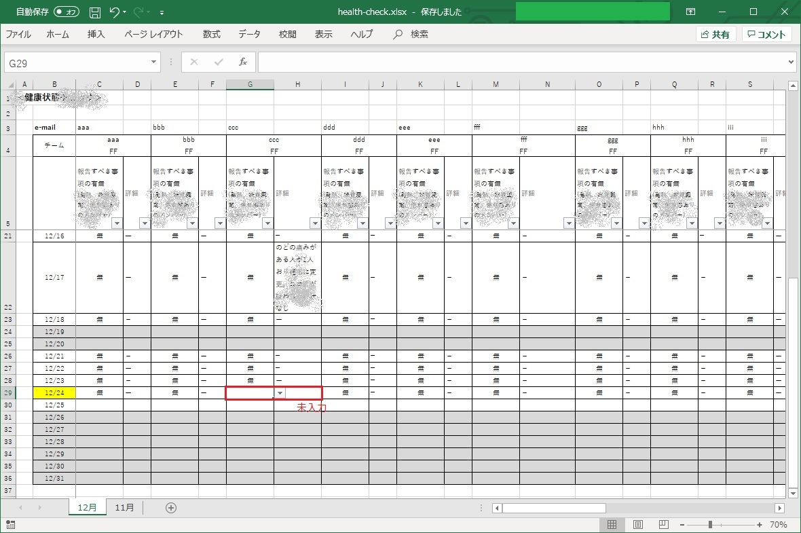

<!-- TOC -->

- [エクセルファイルから特定の行にある未入力のセルを抽出しHTMLメールで通知するツール](#エクセルファイルから特定の行にある未入力のセルを抽出しhtmlメールで通知するツール)
  - [*health-check+a.sh*](#health-checkash)
  - [1. 概要](#1-概要)
    - [1.1. 入力ファイル](#11-入力ファイル)
    - [1.2. 出力ファイル](#12-出力ファイル)
  - [2. 環境](#2-環境)
    - [2.1. サーバー](#21-サーバー)
    - [2.2. シェルとスケジューラーの実行ユーザー](#22-シェルとスケジューラーの実行ユーザー)
    - [2.3. ファイルの保存場所とファイル名](#23-ファイルの保存場所とファイル名)
  - [3. スケジュール](#3-スケジュール)
  - [4. ライセンス License](#4-ライセンス-license)

<!-- /TOC -->

# エクセルファイルから特定の行にある未入力のセルを抽出しHTMLメールで通知するツール

## *health-check+a.sh*

---

## 1. 概要

- 以下のルーチンワークの`2.`を自動化するツールです
- `2.`でチェックした結果を管理者に`HTML`メールで通知します
- `3.`は、`2.`で生成した未入力者リストを使い、別途`PowerAutomate`で実装します（スコープの外）

1. 入力担当者は毎日、メンバーの健康状態を「health-check.xlsx」に入力する
1. 管理者は毎日、「health-check.xlsx」を開いて未入力がないかを確認する
1. 未記入があった場合は、`Teams`のメンションを利用して未入力者に入力を促す

- ツールが送信するメールのイメージ
  - 

### 1.1. 入力ファイル

- 「health-check.xlsx」
  - 入力担当者が毎朝メンバーから健康状態を確認して結果を入力するファイル
  - 「health-check.xlsx」は、入力担当者間に`SharePoint`で共有されているが、本ツールの実行環境が`Linux`であるため、`Z`（共有）ドライブにコピーを置きこれを使用する
  - 3行目は、メンションするためのメールアドレス（エイリアス）
  - 

### 1.2. 出力ファイル

- `mention.xlsx`
  - 未入力者のメールアドレス（エイリアス）を列挙したファイル
  - `PowerAutomate`で利用するためにエクセルファイル（テキストファイルが読めないため）
  - 
- `mention-table.xlsx`
  - `mention.xlsx`にテーブル書式を挿入したファイル
  - `PowerAutomate`が要求しているエクセルファイル形式。日本語不可
  - 
- `email-body.txt`
  - 「health-check.xlsx」から当日の行に記入された症状を抽出したファイル
  - 入力担当者が未入力の場合、「▲未入力」と表示する
  - 本ツールの実行後は、`Z:\path\to\health-check\done`フォルダへ移動される（前日までのログの代用）
- `email-body_utf8.txt`
  - `email-body.txt`の文字コードが`Shift_JIS`の場合、`Linux`用に`UTF-8`に変換したファイル
  - 本ツールの実行後は、`Z:\path\to\health-check\done`フォルダへ移動される（前日までのログの代用）
- `email-address.txt` (未使用)
  - 未入力者のメールアドレス（エイリアス）だけを抽出したファイル
- `emailbody1.html`
  - `HTML`メール用ボディの前半部
- `emailbody2.html`
  - `HTML`メール用ボディの中間部
  - 入力内容
- `emailbody3.html`
  - `HTML`メール用ボディの後半部
- `emailbody.html`
  - `emailbody1.html`、`emailbody2.html`、`emailbody3.html`を結合した`HTML`メール用ボディ


## 2. 環境

### 2.1. サーバー

- `CentOS7@xxx.xxx.xxx.xxx`

### 2.2. シェルとスケジューラーの実行ユーザー

- `vuls`

### 2.3. ファイルの保存場所とファイル名

- シェルスクリプトファイル
  - `/home/vuls/health-check/health-check+a.sh`
  - `Python`ファイルを呼び出して、メールを配信する部分を担当
- Pythonファイル
  - `/home/vuls/health-check/health-check.py`
  - 「health-check.xlsx」から未入力者の抽出と、記入済み内容の抽出を行う部分を担当
- 「health-check.xlsx」のコピーファイル
  - `/mnt/z/path/to/health-check/health-check.xlsx`
- 2.4. ログファイル
  - `/home/vuls/health-check/health-check.log`

## 3. スケジュール

- 月曜日から金曜日、午前11時10分に、`cron`によるスケジュールを実施する
- スケジュールの保存場所とファイル名は、`/var/spool/cron/crontabs/vuls`
- 編集する場合は、`$ crontab -e`を実行すること
- `cron`の内容
  
  ```bash
  PATH=/home/vuls/.pyenv/shims:/home/vuls/.pyenv/bin:/sbin:/bin:/usr/bin:/usr/local/bin:/usr/local/sbin:/usr/sbin:/usr/local/go/bin:/home/vuls/go/bin:/usr/lib/jvm/java/bin:/opt/apache-tomcat/apache-tomcat-7.0.50/bin:/home/vuls/.local/bin:/home/vuls/bin
  MAIL=/var/spool/mail/vuls
  # 分　時　日　月　曜日　コマンド
  05 6 * * 1-5 /home/vuls/vuls-auto2.sh full diff > /var/log/vuls/vuls-auto.log 2>&1
  00 15 * * 1-5 /home/vuls/z-today-mail2.sh > /var/log/vuls/z-today-mail.log 2>&1
  # 00 7 1 * * /home/vuls/Google/google_pwgen.sh > /home/vuls/Google/log/google_pwgen.log 2>&1
  30 11 * * 1 /home/vuls/CAcert/cacert-checkend+a.sh > /home/vuls/CAcert/cacert-checkend.log 2>&1
  00 15 * * 2 /home/vuls/NAVIT/navit-teams+c.sh > /home/vuls/NAVIT/navit.log 2>&1
  10 11 * * 1-5 /home/vuls/health-check/health-check.sh > /home/vuls/health-check/health-check.log 2>&1
  ```

## 4. ライセンス License

事情によりしばらく `NO LICENSE` といたしますので、`GitHub` の利用規約と著作権法が定める範囲を超えた利用・複製・再頒布などを一切禁止させていただきます。

Due to circumstances, it will be `NO LICENSE` for a while, so I will prohibit any use, duplication, redistribution, etc. beyond the scope of the terms of service of` GitHub` and the copyright law.